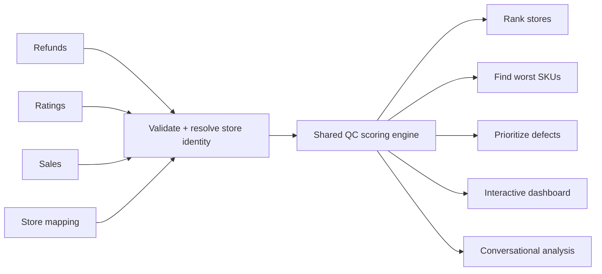

# AI Quality Control for Multi-Chain F&B Operations

Turn thousands of ratings, refunds, complaints and sales records across hundreds of locations into ranked stores, root causes and actionable quality control priorities.


**[Try the live demo](https://vedantm1049.github.io/multi-cafe-quality-control/)** — a static version of the dashboard built from synthetic sample data.

> Built for multi-brand, multi-region F&B operations where quality control cannot rely on manually reviewing spreadsheets store by store.

## What this does

Upload a periodic QC workbook and ask a question in plain language or run a slash command. The system validates the data, resolves store identities across different source systems, applies the same locked scoring rules every time, and returns the operational answer you need.

It can:
- rank the best and worst-performing stores;
- identify the worst-performing SKUs by location;
- prioritize store × defect combinations by operational impact;
- combine refund, rating, sales and complaint signals;
- generate an interactive QC dashboard;
- answer open-ended questions about trends, categories and locations.

The goal is not another dashboard. The goal is to answer one operating question quickly:

**Which locations need attention, why, and what should the team fix first?**

## Why this is hard at scale

Large F&B networks rarely have one clean source of truth. The same location can appear under different names or codes across refunds, ratings, sales and mapping files. High-volume stores naturally generate more complaints and refunds than low-volume stores. Free-text customer feedback also needs to be connected back to structured operational defects.

This system is designed around those problems:

- **Store identity resolution** — maps different store names and identifiers back to one location and surfaces unmatched stores instead of guessing.
- **Volume-aware scoring** — adjusts comparisons so a quiet store with one bad week does not automatically look worse than a busy store with a persistent quality problem.
- **Multiple QC signals** — brings refunds, ratings, sales and customer complaints into one scoring workflow.
- **Root-cause prioritization** — ranks specific store × defect combinations, rather than only showing an overall store score.
- **Consistent decisions** — all commands use one shared scoring engine, so the answer does not change depending on how the question was asked.

## From raw data to action



A typical output does not stop at **"Store X has a low score."** It helps the operator move toward an action such as:

**Store X → Beverage quality → high refund impact → confirmed by customer feedback → investigate first.**

## Six operating workflows

| Skill | Trigger | What it answers |
|---|---|---|
| `cafe-dashboard` | `/cafe-dashboard` | How is the network performing overall? |
| `cafe-worst-skus` | `/cafe-worst-skus` | Which products are creating the most refunds at each store? |
| `cafe-action-points` | `/cafe-action-points` | Which store × defect problems should the team fix first? |
| `cafe-best` | `/cafe-best` | Which stores are performing best? |
| `cafe-worst` | `/cafe-worst` | Which stores need the most attention? |
| `cafe-analysis` | `/cafe-analysis` | What other trends or patterns exist in the data? |

All six skills use the same engine: `scripts/cafe_qc_engine.py`.

That engine handles data loading, validation, store-identity resolution and scoring. The full data contract and formulas are documented in `references/data-contract-and-scoring.md`.

## How the agent works

Every skill follows the same five-step loop:

1. **Locate** — find the uploaded QC workbook.
2. **Validate** — check the workbook structure and surface missing columns, sheets or unmatched stores.
3. **Elicit** — ask only for information that cannot be inferred, such as region, timeframe or output count.
4. **Run** — call the shared Python scoring engine.
5. **Present** — return the result as a table, chart, exportable sheet, dashboard or conversational analysis.

Because the scoring logic lives in one shared engine, a store's score means the same thing whether it appears in `/cafe-best`, `/cafe-worst`, the dashboard or a natural-language question.

## Input data

The current implementation expects a fresh 8-sheet `.xlsx` workbook for each analysis period:

- `refund_region_a`
- `refund_region_b`
- `rating_region_a`
- `rating_region_b`
- `mapping_region_a`
- `mapping_region_b`
- `sales_region_a`
- `sales_region_b`

The structure models two independent operating regions with different store master lists and volume profiles. It can be adapted to other region or brand structures.

No real business data is included in this public repository.

## Live demo

**[Open the demo](https://vedantm1049.github.io/multi-cafe-quality-control/)**

The GitHub Pages demo uses 16 fabricated stores across two synthetic regions. Store names, refunds, ratings and sales are invented, but the outputs are generated using the real scoring logic in `scripts/cafe_qc_engine.py`.

The demo includes:

- network dashboard;
- best stores;
- worst stores;
- worst SKUs;
- prioritized action points.

The current browser demo is a fixed snapshot. It does not yet let a user upload a workbook and run the Python engine directly in the browser. To analyze a new workbook today, use the plugin in Claude Code or Cowork.

## Installation

This repository is structured as a Claude Code / Cowork plugin.

```bash
git clone https://github.com/vedantm1049/multi-cafe-quality-control.git
```

Then add the cloned repository as a plugin source in Claude Code or Cowork.

No external API or credentials are required. The engine requires Python 3 with `pandas`, `numpy` and `openpyxl`.

## Usage

Upload the QC workbook and either run one of the six slash commands or ask a question in natural language.

For example:

```text
Show me the 10 worst-performing stores in region_b this month.
```

```text
Which store and defect combinations are driving the highest refund impact?
```

```text
What patterns do you see in customer complaints this period?
```

Every workflow validates the workbook before analysis. If the input has a missing sheet, missing column or unresolved store mapping, the system surfaces the issue instead of silently guessing.

## Scoring and design decisions

The scoring system is intentionally deterministic and documented. AI handles the interaction and workflow orchestration; the core ranking logic remains reproducible.

<details>
<summary><strong>Volume-aware store scoring</strong></summary>

Busier stores handle more transactions and therefore have more opportunities to generate refunds or low ratings. Stores are grouped into Low, Medium and High volume tiers. Their refund and rating signals are adjusted before the network is normalized onto one comparison scale.

The current multipliers are Low ×1.30, Medium ×1.00 and High ×0.75.

See `assign_volume_tiers()` and `compute_store_table()` in `scripts/cafe_qc_engine.py`, plus the worked example in `references/data-contract-and-scoring.md`.

</details>

<details>
<summary><strong>Minimum sample floor</strong></summary>

The engine protects selected rankings from tiny sample sizes. The current minimum floor is 10 rated orders / 1,200 units sold per store and is applied asymmetrically according to the operating rules encoded in the engine.

The floor uses sales volume rather than refund count because sales form the denominator of the refund rate.

See `floor_applies()` in `scripts/cafe_qc_engine.py` for the exact implementation.

</details>

<details>
<summary><strong>Store identity resolution</strong></summary>

Refund, rating and sales data can identify the same store differently. The mapping layer resolves those identifiers before scoring.

Known aliases can be configured explicitly. New unmatched names are surfaced during validation rather than automatically merged into the wrong store.

</details>

<details>
<summary><strong>Customer-feedback confirmation</strong></summary>

Action points can be checked against customer complaint tags. A defect-to-complaint mapping determines whether an operational defect is independently supported by customer feedback.

Unknown defect codes fall back safely rather than being treated as confirmed.

</details>

For the complete implementation details, see `references/data-contract-and-scoring.md` and `references/running-the-engine.md`.

## Project structure

```text
.claude-plugin/                 Plugin metadata
skills/                         Six agent skills / commands
scripts/cafe_qc_engine.py       Shared validation and scoring engine
references/                     Data contract, scoring and workflow docs
docs/                           GitHub Pages demo
LICENSE                         MIT license
```

## Roadmap

The main next step is a fully interactive browser version:

**Upload your own workbook → run the QC engine → get live rankings and action points without requiring Claude Code or Cowork.**

## License

MIT — see [LICENSE](LICENSE).
