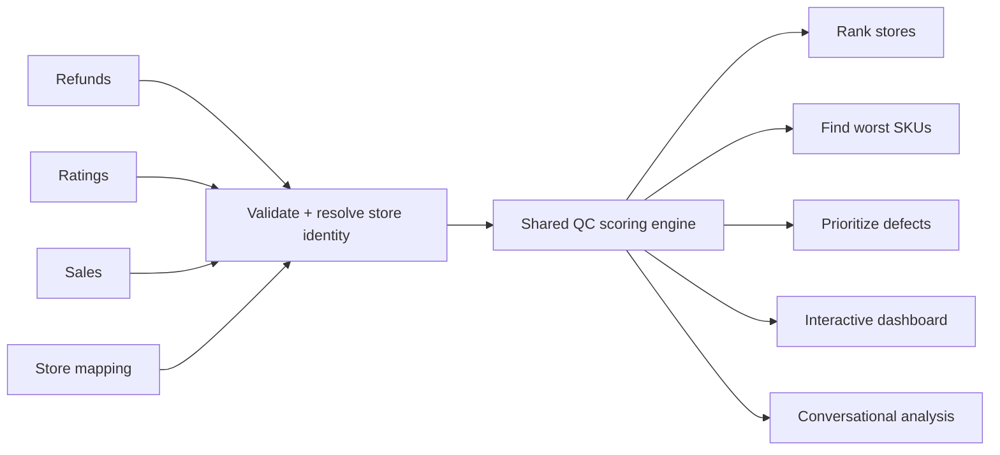

# AI Quality Control for Multi-Chain F&B Operations

Turn thousands of ratings, refunds, complaints and sales records across hundreds of locations into ranked stores, root causes and actionable quality control priorities.


**[Try the live app](https://multi-cafe-quality-control.streamlit.app/)** — upload your own 8-sheet QC workbook or run the included synthetic sample end-to-end.

**[Open the static preview](https://vedantm1049.github.io/multi-cafe-quality-control/)** — browse the same synthetic sample as a fixed GitHub Pages dashboard.

> Built for multi-brand, multi-region F&B operations where quality control cannot rely on manually reviewing spreadsheets store by store.

## What this does

Upload a periodic QC workbook and ask a question in plain language or run a slash command. The system validates the data, resolves store identities across different source systems, applies the same locked scoring rules every time, and returns the operational answer you need.

It can:

- rank the best and worst-performing stores;
- identify the worst-performing SKUs by location;
- prioritize store × defect combinations by operational impact;
- combine refund, rating, sales and complaint signals;
- generate an interactive QC dashboard;
- answer open-ended questions about trends, categories and locations.

The goal is not another dashboard. The goal is to answer one operating question quickly:

**Which locations need attention, why, and what should the team fix first?**

## Try it yourself

Open the **[live Streamlit app](https://multi-cafe-quality-control.streamlit.app/)**.

You can either:

1. upload your own `.xlsx` workbook that matches the 8-sheet data contract; or
2. click **Use Sample Workbook** to run a deterministic synthetic dataset immediately.

The static GitHub Pages preview uses the **same synthetic dataset**, so the store names, rankings, SKU issues and action points are directly comparable between the two demos.

## Why this is hard at scale

Large F&B networks rarely have one clean source of truth. The same location can appear under different names or codes across refunds, ratings, sales and mapping files. High-volume stores naturally generate more complaints and refunds than low-volume stores. Free-text customer feedback also needs to be connected back to structured operational defects.

This system is designed around those problems:

- **Store identity resolution** — maps different store names and identifiers back to one location and surfaces unmatched stores instead of guessing.
- **Volume-aware scoring** — adjusts comparisons so a quiet store with one bad week does not automatically look worse than a busy store with a persistent quality problem.
- **Multiple QC signals** — brings refunds, ratings, sales and customer complaints into one scoring workflow.
- **Root-cause prioritization** — ranks specific store × defect combinations rather than only showing an overall store score.
- **Consistent decisions** — all commands use one shared scoring engine, so the answer does not depend on how the question was asked.

## From raw data to action



A typical output does not stop at **"Store X has a low score."** It helps the operator move toward an action such as:

**Store X → Beverage quality → high refund impact → confirmed by customer feedback → investigate first.**

## Six operating workflows

| Skill | Trigger | What it answers |
|---|---|---|
| `cafe-dashboard` | `/cafe-dashboard` | How is the network performing overall? |
| `cafe-worst-skus` | `/cafe-worst-skus` | Which products are creating the most refunds at each store? |
| `cafe-action-points` | `/cafe-action-points` | Which store × defect problems should the team fix first? |
| `cafe-best` | `/cafe-best` | Which stores are performing best? |
| `cafe-worst` | `/cafe-worst` | Which stores need the most attention? |
| `cafe-analysis` | `/cafe-analysis` | What other trends or patterns exist in the data? |

## How the agent works

Every skill follows the same five-step loop:

1. **Locate** — find the uploaded QC workbook.
2. **Validate** — check the workbook structure and surface missing columns, sheets or unmatched stores.
3. **Elicit** — ask only for information that cannot be inferred, such as region, timeframe or output count.
4. **Run** — call the shared Python scoring engine.
5. **Present** — return the result as a table, chart, exportable sheet, dashboard or conversational analysis.

## Input data

The current implementation expects a fresh 8-sheet `.xlsx` workbook for each analysis period:

- `refund_region_a`
- `refund_region_b`
- `rating_region_a`
- `rating_region_b`
- `mapping_region_a`
- `mapping_region_b`
- `sales_region_a`
- `sales_region_b`

The structure models two independent operating regions with different store master lists and volume profiles. It can be adapted to other region or brand structures.

No real business data is included in this public repository.

## Scoring

The scoring system is deterministic and documented. AI handles the interaction and workflow orchestration; the core ranking logic remains reproducible.

The composite QC score combines two **badness / risk** measures:

- refund badness;
- rating badness.

Both are adjusted using the same volume handicap before being combined.

**Lower score = better quality. Higher score = greater QC risk.**

<details>
<summary><strong>Volume-aware store scoring</strong></summary>

Busier stores handle more transactions and therefore have more opportunities to generate refunds or low ratings. Stores are grouped into Low, Medium and High volume tiers.

The current multipliers are:

- Low ×1.30
- Medium ×1.00
- High ×0.75

</details>

<details>
<summary><strong>Minimum sample floor</strong></summary>

The current minimum floor is 10 rated orders / 1,200 units sold per store and is applied asymmetrically according to the operating rules encoded in the engine.

The floor uses sales volume rather than refund count because sales form the denominator of the refund rate.

</details>

<details>
<summary><strong>Store identity resolution</strong></summary>

Refund, rating and sales data can identify the same store differently. The mapping layer resolves those identifiers before scoring.

Known aliases can be configured explicitly. New unmatched names are surfaced during validation rather than automatically merged into the wrong store.

</details>

<details>
<summary><strong>Customer-feedback confirmation</strong></summary>

Action points can be checked against customer complaint tags. A defect-to-complaint mapping determines whether an operational defect is independently supported by customer feedback.

Unknown defect codes fall back safely rather than being treated as confirmed.

</details>

For the complete implementation details, see `references/data-contract-and-scoring.md` and `references/running-the-engine.md`.

## Keeping the demos synchronized

`scripts/sample_workbook.py` defines the deterministic synthetic dataset used by the Streamlit sample flow.

`scripts/build_static_demo.py` regenerates the GitHub Pages demo artifacts from that same workbook, and `.github/workflows/build-static-demo.yml` provides a repeatable build path when the sample or scoring logic changes.

That keeps the live sample and static preview from becoming two unrelated demos over time.

## Installation

This repository is also structured as a Claude Code / Cowork plugin.

```bash
git clone https://github.com/vedantm1049/multi-cafe-quality-control.git
```

No external API credentials are required for the deterministic QC engine. Python dependencies are listed in `requirements.txt`.

## Project structure

```text
streamlit_app.py                 Live upload-and-analyze web app
scripts/cafe_qc_engine.py        Core validation and scoring engine
scripts/cafe_qc_web_engine.py    Corrected web/demo scoring entrypoint
scripts/sample_workbook.py       Shared synthetic sample generator
scripts/build_static_demo.py     Static demo build step
skills/                          Six agent skills / commands
references/                      Data contract, scoring and workflow docs
docs/                            GitHub Pages static preview
LICENSE                          MIT license
```

## License

MIT — see [LICENSE](LICENSE).
